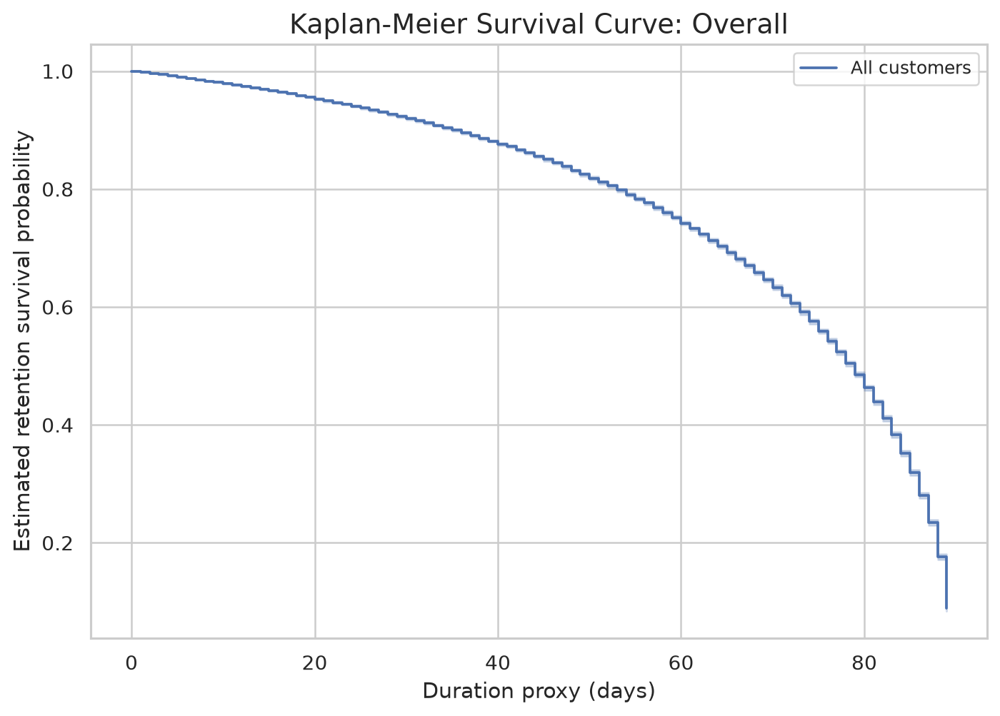
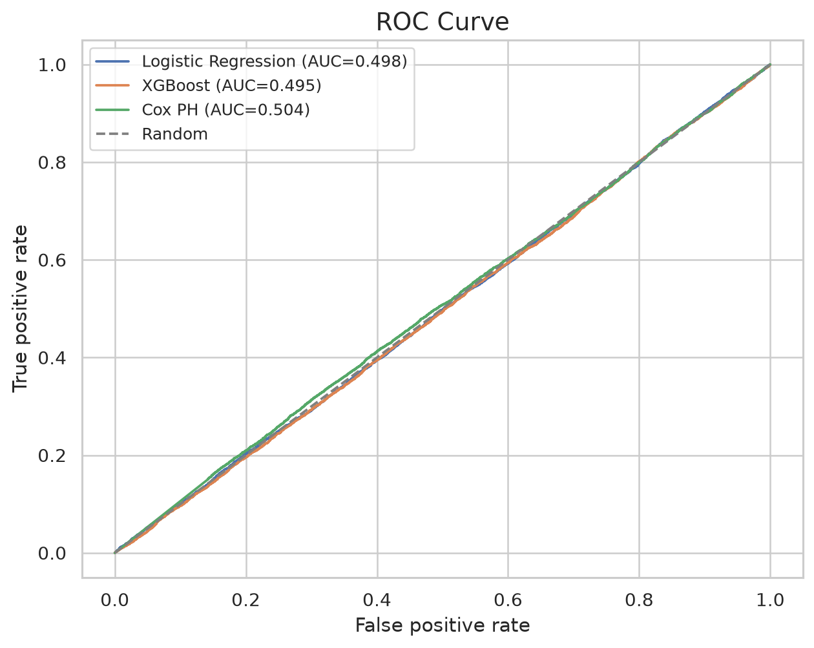
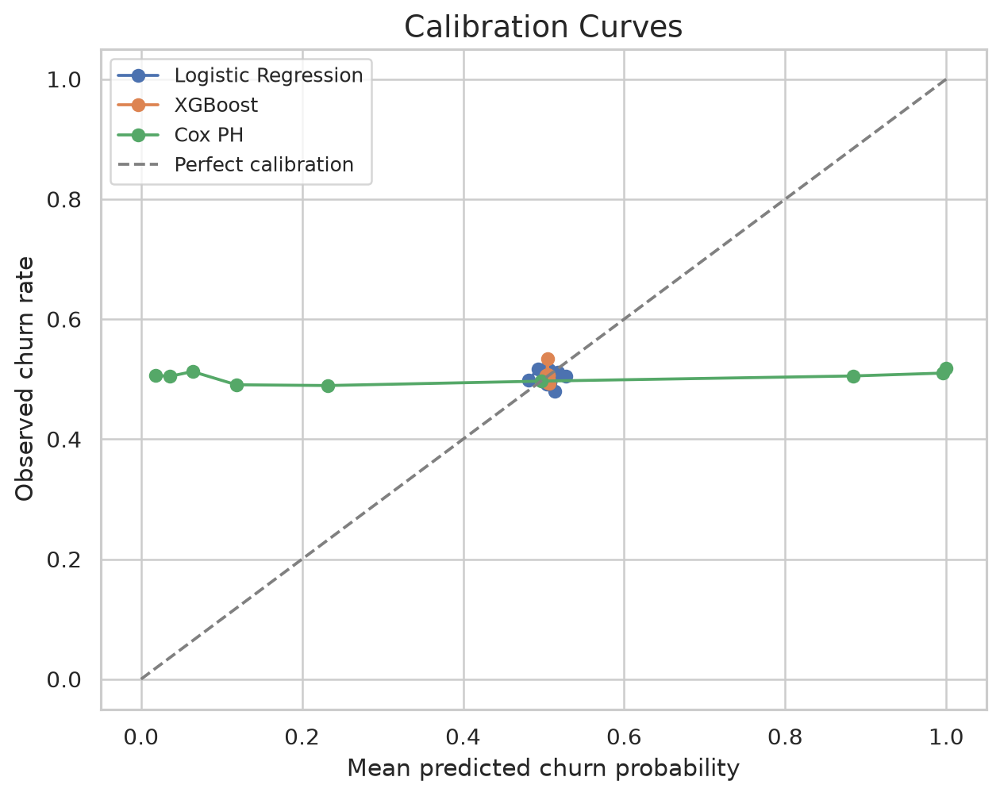
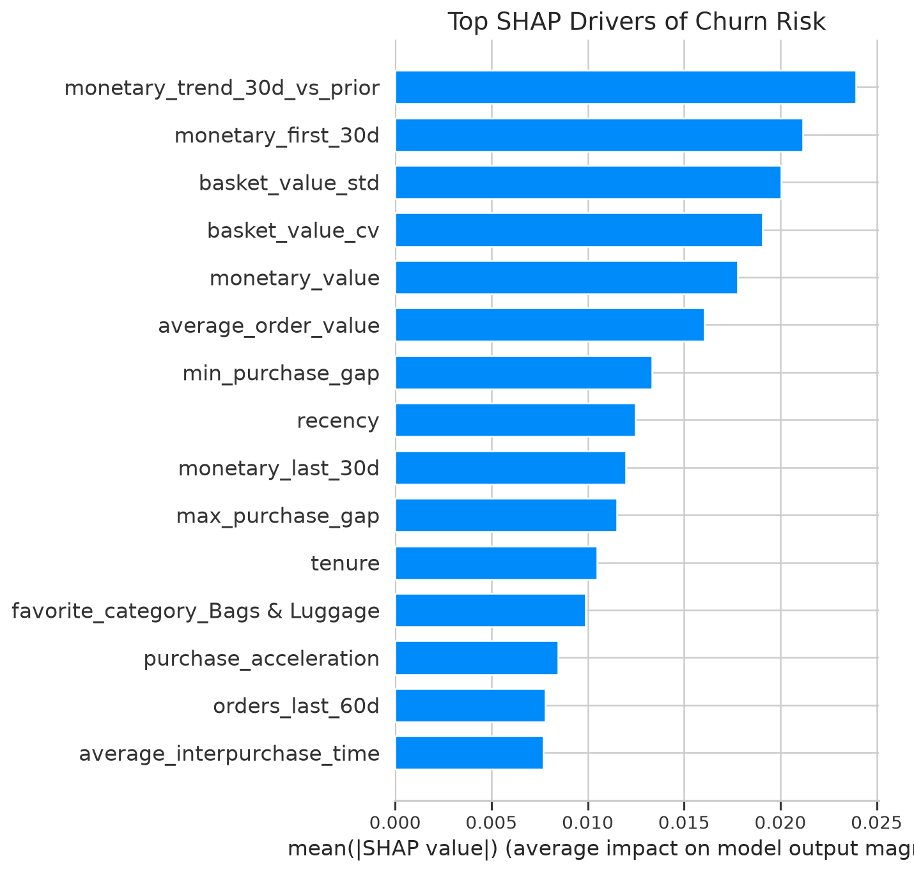
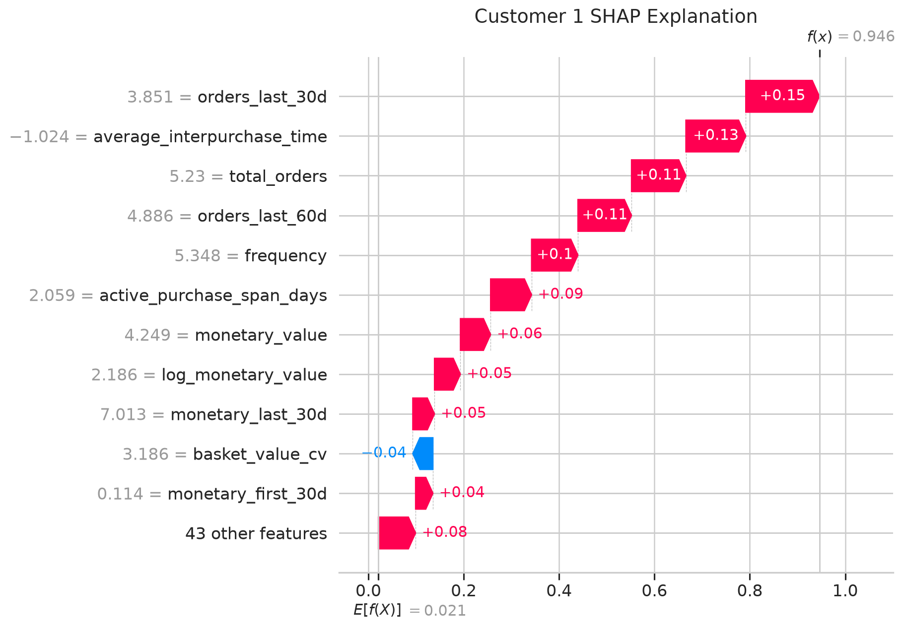
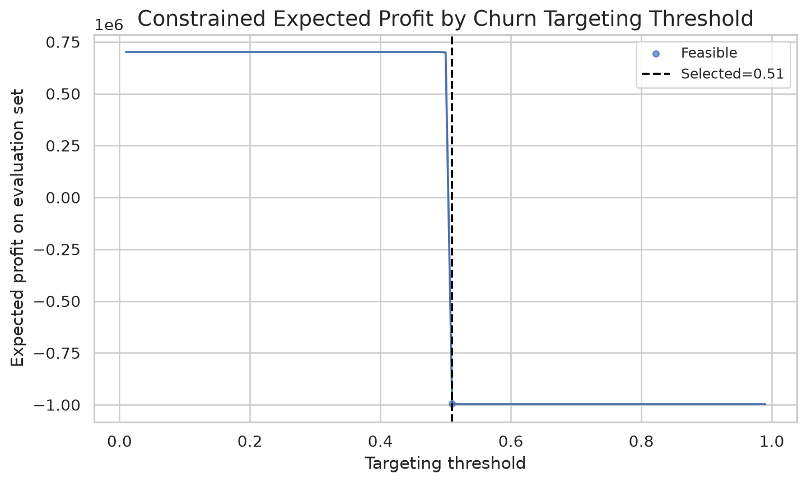

# Customer Retention Analytics from an E-Commerce Data Warehouse

## 1. Project Overview

This project builds an end-to-end customer retention analytics workflow from a transactional e-commerce data warehouse. The source data is a star-schema / warehouse-style dataset where customer disengagement must be constructed from purchase behavior.

Project objective:

> Given a fixed window of customer transaction history, estimate future disengagement risk and translate model outputs into retention-budget recommendations.

The workflow includes raw data ingestion, schema discovery, feature extraction, churn-label construction, survival analysis, classification modeling, calibration, explainability, and business decision policy. The current models do not show strong predictive discrimination, and the project treats that honestly as a validation finding rather than overstating performance.

## 2. Dataset

The project uses the Kaggle:

```text
E-Commerce Data Warehouse Dataset: https://www.kaggle.com/datasets/shandeep777/e-commerce-data-warehouse-dataset/data
```

This dataset contains warehouse-style transactional tables rather than one ready-made modeling file.

Because the dataset is transactional, it requires preprocessing before modeling. Customer churn is not directly provided as a clean target variable, and this project derives churn from observed customer purchase inactivity.

> Because the target is derived rather than provided, model quality depends heavily on whether the churn definition matches the actual purchase cadence in the dataset.

## 3. Business Question

```text
Given 90 days of transactional history, which customers are most likely to churn or disengage in the next 30 days, and how should a constrained retention budget be allocated?
```

The project treats this as both:

1. a classification problem, predicting 30-day churn/disengagement risk;
2. a survival-analysis problem, estimating the timing and probability of customer inactivity.

## 4. Technologies and Methods Used

The workflow is implemented in Python with pandas and NumPy for data wrangling, scikit-learn for baseline modeling and evaluation, XGBoost for nonlinear classification, lifelines for survival analysis, SHAP for model explainability, matplotlib/seaborn for plots, and Jupyter Notebook for narrative analysis.

The modeling approach uses SQL-style warehouse analytics concepts such as customer-level aggregation, windowed feature extraction, and RFM-style behavioral summaries. The current implementation performs these transformations in Python so the project can run directly from CSV files without requiring a database.

Statistical and machine-learning methods include churn-label construction, Kaplan-Meier survival curves, Logistic Regression, XGBoost classification, Cox Proportional Hazards modeling, probability calibration, Brier score, ROC-AUC, PR-AUC, SHAP explanations, threshold optimization using a cost-benefit matrix, and a constrained retention-budget policy.

## 5. Preprocessing and Data Wrangling

### Raw data ingestion

Raw CSV files are discovered from the provided data folder. The loader inspects available files programmatically and maps the most relevant customer, order, date, amount, product, category, and status fields when present.

### Column normalization

Column names are normalized to lowercase `snake_case` so that downstream feature engineering is robust to small naming differences across CSV files.

### Customer-level aggregation

Transaction-level and order-line-level data are transformed into one row per customer. Order lines are aggregated to order-level amounts before customer features are computed.

### Feature engineering

The processed table includes RFM and behavioral features such as recency, frequency, monetary value, tenure, average order value, average inter-purchase time, purchase gap statistics, recent order counts, recent monetary trends, log monetary value, basket value variation, value segments, and product/category diversity when available.

The enhanced modeling table is written to:

```text
data/processed/churn_modeling_table_enhanced.csv
```

### Churn label construction

The target is derived from purchase inactivity:

```text
churn_30d = 1
```

if a customer has no observed purchase in the 30 days following the 90-day observation window.

```text
churn_30d = 0
```

if the customer does purchase in that future window.

This label is useful for a reproducible churn experiment, but it is imperfect. If the natural purchase cycle is longer than 30 days, some customers may look churned even though they are behaving normally. Label diagnostics are therefore included to inspect churn rate, one-order customers, purchase gaps, available future time, and near-end label instability.

### Leakage prevention

Customer identifiers, target columns, future-window variables, prediction-window dates, event labels, and post-outcome fields are excluded from model features. Customer IDs are retained only for output tables and recommendations.

## 6. Modeling Approach

### Logistic Regression

Logistic Regression is used as an interpretable baseline. It provides a transparent benchmark for whether more complex models add value beyond linear relationships in customer behavior.

### XGBoost

XGBoost is included because it can capture nonlinear relationships and interactions, such as combinations of recency, monetary value, purchase gaps, and category behavior.

### Cox Proportional Hazards

The Cox Proportional Hazards model provides a survival-analysis view of customer inactivity. It models time-to-event behavior and supports retention analysis from a timing perspective. Its coefficients should be interpreted only after checking proportional hazards assumptions. Customers who do not churn within the observed follow-up are treated as right-censored for survival-style analysis.

### Calibration

Calibration matters because retention decisions depend on probability quality, not just customer ranking. A model used for coupon allocation should not only order customers by risk; its probabilities should be reliable enough to support cost-benefit decisions. The workflow evaluates calibration curves, Brier score, and log loss.

## 7. Results

Current validation results are near random:

| Model | ROC-AUC | Interpretation |
|---|---:|---|
| Logistic Regression | ~0.498 | Near-random discrimination |
| XGBoost | ~0.495 | Near-random discrimination |
| Cox Proportional Hazards | ~0.504 | Near-random discrimination |

The fixed-window churn label currently produces weak separability. The workflow is functional and reproducible, but the available transaction-derived features do not provide strong churn signal under this target definition.

This should be interpreted as a model validation finding, not hidden as a failure. The model should not be deployed for real retention spending without stronger signal, richer features, multiple temporal snapshots, or a better target definition aligned to customer purchase cadence.

> **Key finding:** Under a fixed 90-day history / 30-day churn definition, the available transactional features do not strongly distinguish churned from retained customers. The project therefore emphasizes diagnostics, calibration, survival analysis, and constrained policy design rather than overstating predictive performance.

## 8. Plots and Tables

### Survival analysis plots



- [Kaplan-Meier overall survival curve](assets/plots/kaplan_meier_overall.png)
- [Kaplan-Meier by value segment](assets/plots/kaplan_meier_by_value_segment.png)
- [Kaplan-Meier by frequency segment](assets/plots/kaplan_meier_by_frequency_segment.png)

### Model evaluation plots





- [ROC curve](assets/plots/roc_curve.png)
- [Precision-recall curve](assets/plots/precision_recall_curve.png)
- [Calibration curves](assets/plots/calibration_curves.png)
- [Brier score comparison](assets/plots/brier_score_comparison.png)
- [Confusion matrix at selected threshold](assets/plots/confusion_matrix_selected_threshold.png)
- [Model probability distributions](assets/plots/model_probability_distributions.png)
- [Baseline vs. ML ROC-AUC](assets/plots/baseline_vs_ml_auc.png)

### Diagnostics and EDA plots

- [Churn label distribution](assets/plots/churn_label_distribution.png)
- [Purchase gap distribution](assets/plots/purchase_gap_distribution.png)
- [Customer order count distribution](assets/plots/customer_order_count_distribution.png)
- [Churn rate by segment](assets/plots/churn_rate_by_segment.png)
- [Feature distributions](assets/plots/feature_distributions.png)
- [Correlation heatmap](assets/plots/correlation_heatmap.png)
- [Recency vs. monetary scatter](assets/plots/recency_vs_monetary_scatter.png)

### Explainability plots





- [SHAP summary bar plot](assets/plots/shap_summary_bar.png)
- [SHAP summary beeswarm plot](assets/plots/shap_summary_beeswarm.png)
- [Customer-level SHAP explanations](assets/shap/)
- [XGBoost feature importance](assets/plots/xgboost_feature_importance_gain.png)
- [Logistic regression coefficients](assets/plots/logistic_coefficients.png)

### Retention policy plots



- [Threshold profit curve](assets/plots/threshold_profit_curve.png)
- [Constrained threshold profit curve](assets/plots/threshold_profit_curve_constrained.png)

### Tables

- [Model metrics](assets/tables/model_metrics.csv)
- [Baseline model metrics](assets/tables/baseline_model_metrics.csv)
- [Threshold analysis](assets/tables/threshold_analysis.csv)
- [Constrained threshold analysis](assets/tables/threshold_analysis_constrained.csv)
- [Selected constrained threshold](assets/tables/selected_threshold_constrained.json)
- [Scored customers](assets/tables/scored_customers.csv)
- [Constrained scored customers](assets/tables/scored_customers_constrained.csv)
- [Retention budget summary](assets/tables/retention_budget_summary.csv)
- [Constrained retention budget summary](assets/tables/retention_budget_summary_constrained.csv)
- [Churn label diagnostics](assets/tables/churn_label_diagnostics.csv)
- [Feature importance table](assets/tables/xgboost_feature_importance.csv)
- [Logistic regression coefficients](assets/tables/logistic_coefficients.csv)
- [Cox model summary](assets/tables/cox_summary.csv)
- [Proportional hazards diagnostics](assets/tables/proportional_hazards_diagnostics.txt)

## 9. Retention Policy

The project translates churn probabilities into retention recommendations using a cost-benefit threshold and operational constraints.

An unconstrained optimizer may select a very low threshold when the assumed cost of churn is much larger than the coupon cost. In this project, the unconstrained policy can mark nearly everyone as high risk, which is mathematically consistent with the cost assumptions but not operationally useful.

The improved constrained policy:

- limits the share of customers targeted;
- requires minimum estimated LTV;
- respects coupon budget caps;
- separates high-, medium-, and low-risk groups.

Example policy:

```text
High risk: predicted churn probability above the constrained threshold, LTV >= $500, and top 20% of model risk scores -> $15 coupon.
Medium risk: moderate risk and LTV >= $500 -> $5 coupon.
Low risk: no coupon.
```

This policy is illustrative and should not be deployed for real coupon spend unless model discrimination and probability calibration improve.

## 10. Statistical Assumptions and Limitations

### Churn definition sensitivity

A fixed 30-day churn horizon may not match actual customer purchase cycles. If many customers naturally buy every 45, 60, or 90 days, a 30-day inactivity label can create noisy churn targets.

### Right-censoring

Customers near the end of the dataset may appear inactive because there is limited future observation time. The diagnostics table reports the share of labels that may be unstable near the dataset end.

### Proportional hazards assumption

The Cox model assumes feature effects are proportional over time. Hazard ratios should not be interpreted as stable business effects unless proportional hazards diagnostics are reviewed.

### Weak discrimination

ROC-AUC values near 0.50 indicate weak ranking ability. In the current run, simple RFM baselines and ML models all perform close to random.

### Business limitations

A calibrated but weak model should not drive coupon spend without additional validation. Stronger labels, richer behavioral data, and future-period validation are needed before production use.
